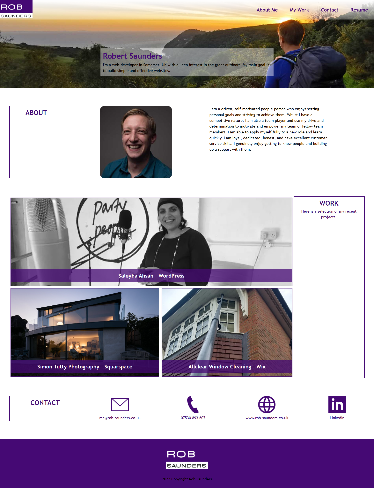

# Portfolio-Website

## Description

A portfolio website is required to be built showcasing the HTML and CSS I have learnt so far, especially FlexBox and Grid. 

The portfolio application is to be built from scratch but must resemble the screenshot gif below. There are several criteria that must be met for this portfolio application and are as follows:

* My name (Robert Saunders) must be displayed along with a recent profile picture as well as links to sections about me, my work and how to contact me
* When a navigation link is clicked, the UI must scroll to the corresponding section
* The section that displays my work must contained titled images of my applications
* The first application's image should be larger in size than the others
* When images of the applications are clicked then the user is taken to that deployed application
* The website must be responsive to the viewport of any size screen

## Usage

You can see the live portfolio application here: https://r0bsaunders.github.io/Portfolio-Website/

The GitHub repository can be found here: https://github.com/R0bsaunders/Portfolio-Website

Here is a screenshot of my portfolio:

Brand colors are as follows (becasue it's my favourite colour):

* #450974
* rgb(69, 9, 116)

## Credits

Screendhot - © 2022 edX Boot Camps LLC. Confidential and Proprietary. All Rights Reserved.

## License

There is no license - However, my contact details may not be used for sales or marketing, and may not be sold or provided to anyone without my express consent. My contact detials may be used only for the purpose of demonstrating the code I have learnt and for potential job / work opportunities. No recruiters please.

